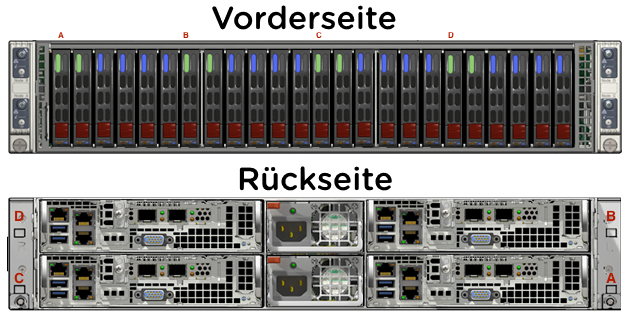

.. clusterdetails:

--------------------
Bootcamp Cluster Details
--------------------

Cluster Hardware Details
++++++++++++++++++++++++

**Hardware Modell: NX-3060-G5**

.. list-table::
   :widths: 15 40
   :header-rows: 1

   * - Eigenschaft
     - Austattung
   * - **CPU Modell**
     - Intel(R) Xeon(R) CPU E5-2650 v4 @ 2.20GHz
   * - **CPU Core**
     - 24 Core pro Node / 96 Core pro Cluster
   * - **CPU Ghz**
     - 53 Ghz pro Node / 212 Ghz pro Cluster
   * - **Arbeitsspeicher**
     - 256 GB pro Node / 1024 GB pro Cluster
   * - **SSD**
     - 4800 GB pro Node / 19200 GB pro Cluster

.. note::
  Bedenken Sie bitte, dass diese HPoC Testumgebung zum einen nicht auf der neuesten Hardware besteht und das zum anderen aufgrund der Entfernung entsprechende Latenzen auftreten können. Nichtsdesto trotz lässt sich mit dieser Umgebung sehr gut erfahren wie einfach typische Routine Aufgaben mit einer Nutanix Plattform durchgeführt werden können.

Infrastruktur IP's
+++++++++++++

.. list-table::
   :widths: 10 10 10 10
   :header-rows: 1

   * - Node
     - CVM
     - Hypervisor
     - IPMI
   * - **Position A**
     - 10.42.31.29
     - 10.42.31.25
     - 10.42.31.33
   * - **Position B**
     - 10.42.31.30
     - 10.42.31.26
     - 10.42.31.34
   * - **Position C**
     - 10.42.31.31
     - 10.42.31.27
     - 10.42.31.35
   * - **Position D**
     - 10.42.31.32
     - 10.42.31.28
     - 10.42.31.36

.. list-table::
   :widths: 20 10
   :header-rows: 1

   * - Dienst
     - IP Adresse
   * - **Virtuelle IP Adresse Cluster**
     - 10.42.31.37
   * - **iSCSI Data Services IP**
     - 10.42.31.38

Virtuelle Maschienen
++++++++++++++++++++

Die folgenden VM's wurden bereits auf dem Cluster ausgerollt:

.. list-table::
   :widths: 25 25 50
   :header-rows: 1

   * - VM Name
     - IP Adresse
     - Beschreibung
   * - **Prism Central**
     - 10.42.31.39
     - Nutanix Prism Central
   * - **AutoDC2**
     - 10.42.31.40
     - ntnxlab.local Domain Controller
   * - **X-Ray 3.4.0**
     - 10.42.31.47
     - X-Ray VM
   * - **Move**
     - 10.42.31.46
     - Move VM

Images / VM Vorlagen & ISO's
++++++++++++++++++++++++++++

Die folgenden Disk Images & ISO's wurden bereits im Vorfeld auf den Image Service des Clusters hochgeladen, sodass die diese leicht verwendet werden können:

.. list-table::
   :widths: 20 7 50
   :header-rows: 1

   * - Image Name
     - Typ
     - Beschreibung
   * - **CentOS7.iso**
     - ISO
     - Ein CentOS7 ISO
   * - **CentOS7.qcow2**
     - DISK
     - Ein bereits vorgefertigtes CentOS 7 Disk Image
   * - **MSSQL-2016-VM.qcow2**
     - DISK
     - Ein Windows Server 2016 Standard Image mit MS SQL 2016 vorinstalliert.
   * - **Nutanix-VirtIO-1.1.3.iso**
     - ISO
     - Ein ISO mit den Nutanix VM Treibern.
   * - **ToolsVM.qcow2**
     - DISK
     - Ein vorkonfiguriertes Windows Server 2012 R2 + Tools (pgAdmin, CyberDuck, text editors, etc.) Disk Image
   * - **Windows10-1709.qcow2**
     - DISK
     - Ein Windows 10 Disk Image.
   * - **Windows10.iso**
     - ISO
     - Eine Windows 10 ISO.
   * - **Windows2012R2.iso**
     - ISO
     - Eine Windows2016 ISO.
   * - **Windows2012R2.qcow2**
     - DISK
     - Ein Windows2016 Disk Image.
   * - **Windows2016.iso**
     - ISO
     - Ein Windows2016 ISO
   * - **Windows2016.qcow2**
     - DISK
     - Ein Windows2016 Disk Image

Zugangsdaten
++++++++++++

Die folgende Tabelle führt die standardmäßig hinterlegten Zugangsdaten für die Umgebung auf (falls andere zum Einsatz kommen sollten wird dies gesondert aufgeführt):

.. list-table::
  :widths: 20 20 10
  :header-rows: 1

  * - Name
    - Benutzername
    - Passwort
  * - **IPMI**
    - ADMIN
    - ADMIN
  * - **Prism Element**
    - admin
    - nx2Tech210!
  * - **Prism Element VM's**
    - nutanix
    - nx2Tech210!
  * - **Prism Central**
    - admin
    - nx2Tech210!
  * - **Prism Central VM**
    - nutanix
    - nx2Tech210!
  * - **NTNXLAB Domain**
    - NTNXLAB\\Administrator
    - nutanix/4u
  * - **CentOS VM Image**
    - root
    - nutanix/4u
  * - **X-Ray VM**
    - root
    - nutanix/4u
  * - **Move**
    - nutanix
    - nutanix/4u

Darüber hinaus besitzt das Cluster eine dedizierte Domain Controller VM, welche Active Directory Dienste für die **NTNXLAB.local** Domain bereitstellt. Die Domain wurde mit folgenden Nutzern und Gruppen vorkonfiguriert:

.. list-table::
  :widths: 20 20 10
  :header-rows: 1

  * - Gruppe
    - Benutzername(n)
    - Passwort
  * - **Administrators**
    - Administrator
    - nutanix/4u
  * - **SSP Admins**
    - adminuser01-adminuser25
    - nutanix/4u
  * - **SSP Developers**
    - devuser01-devuser25
    - nutanix/4u
  * - **SSP Power Users**
    - poweruser01-poweruser25
    - nutanix/4u
  * - **SSP Basic Users**
    - basicuser01-basicuser25
    - nutanix/4u

Netzwerk
++++++++

Die folgenden virtuellen Netzwerke wurden wie folgt vorkonfiguriert:

.. list-table::
   :widths: 33 33 33
   :header-rows: 1

   * -
     - **Primäres** Netzwerk
     - **Sekundäres** Netzwerk
   * - **VLAN**
     - 0
     - 311
   * - **Netzwerk IP Adresse**
     - 10.42.31.0
     - 10.42.31.128
   * - **Netzmaske**
     - 255.255.255.128 (/25)
     - 255.255.255.128 (/25)
   * - **Default Gateway**
     - 10.42.31.1
     - 10.42.31.129
   * - **IP Address Management (IPAM)**
     - Aktiviert
     - Aktiviert
   * - **DHCP Pool**
     - 10.42.31.50 - 125
     - 10.42.31.132-253
   * - **Domain**
     - NTNXLAB.local
     - NTNXLAB.local
   * - **DNS**
     - 10.42.31.40 (DC VM)
     - 10.42.31.40 (DC VM)
   
