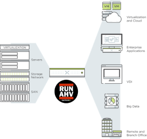

.. title:: Nutanix Technology Bootcamp

.. toctree::
   :maxdepth: 2
   :caption: BootCamp Infos
   :hidden:

   trainer/trainer
   clusteraccess/clusteraccess
   clusterdetails/clusterdetails

.. toctree::
   :maxdepth: 2
   :caption: Labs
   :hidden:

   Lab1/lab1
   Lab2/lab2
   Lab3/lab3
   Lab4/lab4
   Lab5/lab5
   Lab6/lab6
   Lab7/lab7

.. _welcome:

---------------------------
Nutanix Technology Bootcamp
---------------------------

**Herzlich Willkommen auf dem Nutanix Technology Bootcamp!**

Während der heutigen Veranstaltungen lernen Sie:

Vomittags:
  Einen generellen Überblick über das Nutanix Portfolio sowie einen theoretischen Einblick in die Nutanix Architektur.

Nachmittags:
  Nach dem Mittagessen beginnen Sie mit dem praktischen Teil und lernen anhand der einzelnen Lab's Schritt für Schritt die zuvor theoretisch vorgestellte Nutanix Architektur praktisch kennen.

.. note::
   Für die praktischen Teil wird empfohlen entweder individuell auf die Umgebung zuzugreifen oder sich in Teams zusammen zu finden und die Labs gemeinsam zu durchlaufen.
