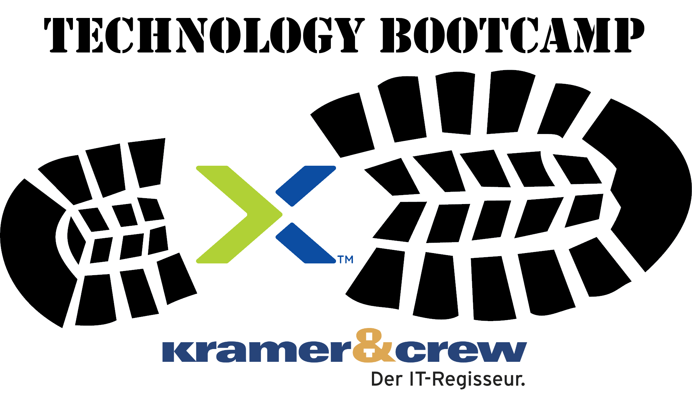

.. title:: Nutanix Technology Bootcamp

.. toctree::
   :maxdepth: 2
   :caption: BootCamp Infos
   :hidden:

   Trainer/trainer
   Zugang/zugang

.. toctree::
   :maxdepth: 2
   :caption: Labs
   :hidden:

   Lab1/lab1
   Lab2/lab2
   Lab3/lab3
   Lab4/lab4
   Lab5/lab5
   Lab6/lab6
   Lab7/lab7

.. _welcome:

---------------------------
Nutanix Technology Bootcamp
---------------------------

**Herzlich Willkommen auf dem Nutanix Technology Bootcamp!**

Während der heutigen Veranstaltungen lernen Sie:

Vomittags:
  Einen generellen Überblick über das Nutanix Portfolio sowie einen theoretischen Einblick in die Nutanix Architektur.

Nachmittags:
  Nach dem Mittagessen beginnen Sie mit dem praktischen Teil und lernen anhand der einzelnen Lab's Schritt für Schritt die zuvor theoretisch vorgestellte Nutanix Architektur praktisch kennen.

.. Hinweis::
   Für die praktischen Teil wird empfohlen entweder individuell auf die Umgebung zuzugreifen oder sich in Teams zusammenzufinden und die Labs gemeinsam zu durchlaufen.

Die Agenda des heutigen Tages:

+-------------------------------------------+
|  Agenda                                   |
+==============+============================+
|  09:00–09:30 |  Registrierung             |
+--------------+----------------------------+
|  09:30–10:00 |  Frühstück & Kennenlernen  |
+--------------+----------------------------+
|  10:00–12:30 |  Vorstellung Nutanix       |
+--------------+----------------------------+
|  12:30–13:30 |  Mittagessen               |
+--------------+----------------------------+
|  13:30–15:30 |  Hands-On Bootcamp         |
+--------------+----------------------------+
|  15:30–16:00 |  Wrap-up & Networking      |
+--------------+----------------------------+
